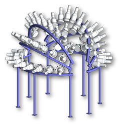

# fission_bicorrelation
This repo contains all of my methods and analysis for investigating the angular correlation of prompt neutrons and gamma-rays emitted from fission. This project was concluded in a paper published in Physical Review C. 

[Here is the paper on the Physical Review C website.](https://doi.org/10.1103/physrevc.100.014605)     
[Here is the final pdf stored locally in this repo.](papers_presentations/2019_phys_rev_c_final.pdf).

# Project overview
The work presented in this repository aims to characterize the angular distribution of prmopt neutrons and gamma-rays emitted from fission. We have performed measurements and built simulation tools for investigating this on Cf-252. 

My collaborator, Matthew Marcath, took measurements of a Cf-252 source positioned at the focal point of the Chi-Nu detector array at Los Alamos National Laboratory (LANL). A model of the detector array is shown below:

We were able to use 47 of the detectors in the array (limited due to our electronics setup). In the bicorrelation analysis detailed in this respository, we look for events in which a trigger was observed in the fission chamber and in two detectors. Such an event in which a neutron and a gamma-ray were detected is illustrated below:

In this event, we have three time stamps:

* `t_0` from the fission chamber. This is the "start" time and our reference time for when the fission occurred.
* `t_A` from detector A
* `t_B` from detector B

These times can be used to calculate the time of flight to detectors A and B:

* `Delta t_A = t_A-t_0`
* `Delta t_B = t_B-t_0`

The distribution of either of these time of flight values is expected to look something like this:

The inital peak is from prompt gamma-ray interactions. Since all gamma-rays travel at the speed of light, they should all arrive at the detector at the same time of flight. The neutrons travel with a distribution of energies, so they arrive at the detector across a range of time of flight values.

When looking at a two-dimensional distribution of these time of flight values across two detectors, we expect to see the following features:

There are four main features observed from detecting two prompt fission emission particles:

1. nn "blob": Extends across a range of `Delta t_A` and `Delta t_B` values according to the neutron time of flight distribution.
2. ng "band": `Delta t_B` ranges over neutron time of flight, `Delta t_A` fixed at gamma time of flight
3. gn "band": Opposite that of ng
4. gg peak: `Delta t_A` and `Delta t_B` fixed at their gamma-ray time of flight values

We will build analysis tools to produce this distribution for our measurements and simulations under various conditions. 

