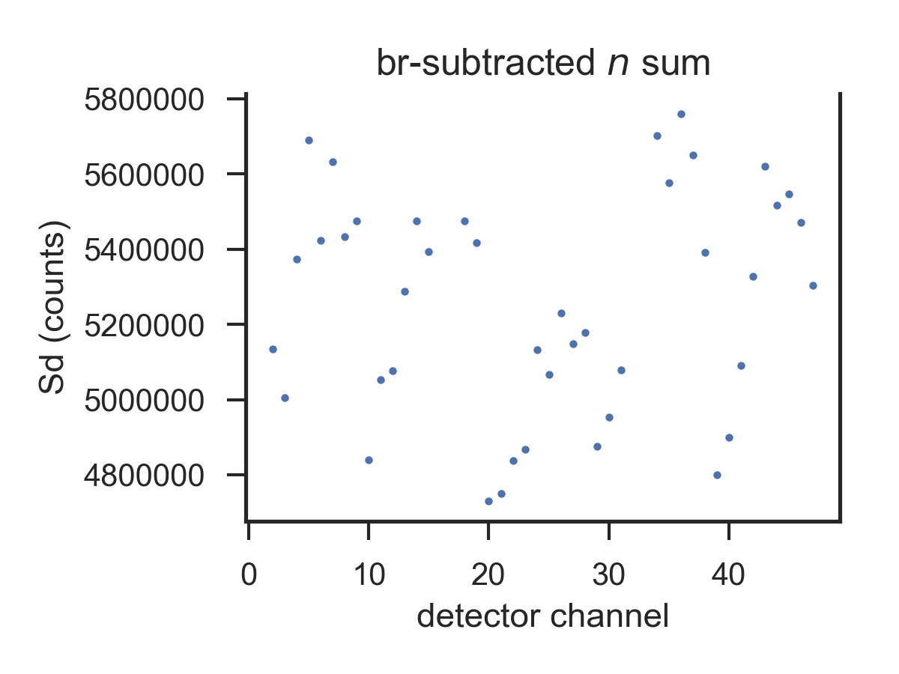
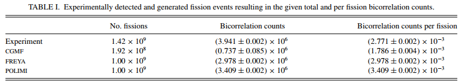

# fission_bicorrelation
This repo contains all of my methods and analysis for investigating the angular correlation of prompt neutrons and gamma-rays emitted from fission. This project was concluded in a paper published in Physical Review C. 

Note that the raw data is not available online because it is 33 TB in size.

[Here is the paper on the Physical Review C website.](https://doi.org/10.1103/physrevc.100.014605)     
[Here is the final pdf stored locally in this repo.](papers_presentations/2019_phys_rev_c_final.pdf).

Disclaimer: This repo is primarily meant for tracking and sharing the scripts and analysis methods. Only a few figures are included here and almost no data is included here.

# Measurement overview and project purpose  

The work presented in this repository aims to characterize the angular distribution of prompt neutrons and gamma-rays emitted from fission. We have performed measurements and built simulation tools for investigating this on Cf-252. 

My collaborator, Matthew Marcath, took measurements of a Cf-252 source positioned at the focal point of the Chi-Nu detector array at Los Alamos National Laboratory (LANL). A model of the detector array is shown below:

We were able to use 47 of the detectors in the array (limited due to our electronics setup). In the bicorrelation analysis detailed in this respository, we look for events in which a trigger was observed in the fission chamber and in two detectors. Such an event in which a neutron and a gamma-ray were detected is illustrated below:

In this event, we have three time stamps:

* `t_0` from the fission chamber. This is the "start" time and our reference time for when the fission occurred.
* `t_A` from detector A
* `t_B` from detector B

These times can be used to calculate the time of flight to detectors A and B:

* `Delta t_A = t_A-t_0`
* `Delta t_B = t_B-t_0`

The distribution of either of these time of flight values is expected to look something like this:

The inital peak is from prompt gamma-ray interactions. Since all gamma-rays travel at the speed of light, they should all arrive at the detector at the same time of flight. The neutrons travel with a distribution of energies, so they arrive at the detector across a range of time of flight values.

When looking at a two-dimensional distribution of these time of flight values across two detectors, we expect to see the following features:

There are four main features observed from detecting two prompt fission emission particles:

1. nn "blob": Extends across a range of `Delta t_A` and `Delta t_B` values according to the neutron time of flight distribution.
2. ng "band": `Delta t_B` ranges over neutron time of flight, `Delta t_A` fixed at gamma time of flight
3. gn "band": Opposite that of ng
4. gg peak: `Delta t_A` and `Delta t_B` fixed at their gamma-ray time of flight values

We will build analysis tools to produce this distribution for our measurements and simulations under various conditions. 

# Analysis and visualization methods

All of my functions are in the [scripts](scripts/) folder and each is extensively documented. The basic functions are broken up into the following scripts:  

* [bicorr.py](scripts/bicorr.py): Most of the core functions exist here, including:    
    * Load detector configuration data, generate dictionary of detector pairs  
    * Read raw `cced` file and generate parsed `bicorr` file  
    * Build singles histogram and bicorr_hist_master    
    * Generate sparse data file, unpack stored sparse data file  
    * Calculate sum of events across given time ranges  
* [bicorr_e.py](scripts/bicorr_e.py): Analogous functions to `bicorr.py` but working with neutron energies instead of time-of-flight  
* [bicorr_sim.py](scripts/bicorr_sim.py): Analogous functions to `bicorr.py` adapted for simulated data  
* [bicorr_math.py](scripts/bicorr_math.py): Supporting math functions    
* [bicorr_plot.py](scripts/bicorr_plot.py): Supporting plotting functions  
* [bicorr_sums.py](scripts/bicorr_sums.py): Calculating sums across the bicorrelation distribution  
* [bicorr_main.py](scripts/bicorr_main.py): Main function for calling process from command line or on cluster    

The following Jupyter notebooks contain my work in developing those functions and demonstrating how they are used.

## Parse `cced`, calculate `singles_hist`

[singles_histogram.ipynb](methods/singles_histogram.ipynb): Here I calculate a histogram of singles count rate events vs. $\Delta t$, the time between the fission chamber event and the corresponding detector interaction. The histogram has the following structure: 

* Dimension 0: particle type (0=n,1=g)  
* Dimension 1: detector channel (need to build a dict_det_to_index for this), 45 in length  
* Dimension 2: dt bin for detector, dt_bin_edges = -300 to 300 in .25 ns steps

## Parse `cced`, produce `bicorr`

[generate_bicorr_from_cced.ipynb](methods/generate_bicorr_from_cced.ipynb): This notebook identifies bicorrelation events from the `cced` list-mode file of all interactions and generates a `bicorr` file, which is a list-mode log of all bicorrelation events. These two files look like this:

`cced` file (columns are `event`, `detector`, `particle_type`, `time`, `integral`, `height`):

    1    7 2 60.43050003051757812500    1.65172    0.20165
    1    40 1 -237.56460189819335937500    0.36266    0.03698
    2    0 2 56.02870178222656250000    1.00000    0.37657
    2    32 2 55.86729812622070312500    1.00000    0.38003
    2    33 2 76.49300003051757812500    0.17479    0.03698
    3    24 2 58.41870117187500000000    0.90767    0.12300
    3    31 2 68.34080123901367187500    0.25033    0.04415
    4    10 1 60.55670166015625000000    6.73639    0.82892

`bicorr` file (columns are `event`, `det1ch`, `det1par`, `det1t`, `det2ch`, `det2par`, `det2t`):

    16  22  2  -0.143900418213  30  2  -143.509488085
    16  22  2  -0.143900418213  43  2  11.6941293987
    16  30  2  -143.509488085  43  2  11.6941293987
    44  29  1  40.8700744099  37  1  46.0955163235
    52  10  2  238.164701554  30  2  -0.665989855469
    76  10  2  -80.4918002156  14  2  -3.35047062158
    87  4  1  33.0194278652  38  2  -1.08306861172
    93  19  1  54.4448179592  20  2  -0.818649601318
    98  7  2  -86.5709508137  34  2  -0.624976884033
    
* Produce `bicorr` from `cced` in folder `1`: `bicorr.generate_bicorr()`
* Produce `bicorr` from `cced` files in folders `1` to `5`: `bicorr.generate_bicorr(1,6)`

## Parse `bicorr`, produce `bicorr_hist_master`

[build_bicorr_hist_master.ipynb](methods/build_bicorr_hist_master.ipynb): Produce the two-dimensional bicorrelation histogram, `bicorr_hist_master` of counts vs. $\Delta_1$ vs. $\Delta_2$ from the `bicorr` file. `bicorr_hist_master` has four dimensions:

* 0: 990 in length: detector pair index (from `det_df`)  
* 1: 4 in length: interaction type (0=nn, 1=np, 2=pn, 3=pp)  
* 2: Default 1000 in length: $\Delta t$ for detector 1, from `dt_bin_edges`  
* 3: Default 1000 in length: $\Delta t$ for detector 2, from `dt_bin_edges`  

The default time range and in `bicorr_hist_master` is 0.25 ns over a time range of -50 to 200 ns. This produces an array approximately 15 GB in size. It can be shrunk and stored to disk using the sparse matrix technique (described next). 

To run:

* Load `det_df`: `det_df = bicorr.load_det_df(filepath=r'filepath')`
* If different time bins are desired, generate with `dt_bin_edges, num_dt_bins = bicorr.build_dt_bin_edges(dt_min=-50,dt_max=200,dt_step=0.25,print_flag=False)`
* Run it, specifying folders
    * Run for folder `1`: `bicorr_hist_master = bicorr.build_bhm(det_df, dt_bin_edges = dt_bin_edges)[0]`
    * Run for folders `1` to `5`: `bicorr_hist_master = bicorr.build_bhm(det_df, 1, 6, dt_bin_edges = dt_bin_edges)[0]`
* If `save_flag = True`, will store a sparse matrix version to disk as explained in next section

[implement_sparse_matrix.ipynb](methods/implement_sparse_matrix.ipynb): Convert `bicorr_hist_master` from a numpy array to a sparse matrix, in which I only store the indices and values of each nonzero element. This cuts down the file size from 1 GB to 30 MB for 1 ns time binning and from 15 GB to 0.5 GB for 0.25 ns time binning.

* Store `bicorr_hist_master` as a sparse matrix `sparse_bhm`: `sparse_bhm = bicorr.generate_sparse_bhm(bicorr_hist_master)`
* Save `sparse_bhm` to file: `bicorr.save_sparse_bhm(sparse_bhm, det_df, dt_bin_edges, 'sparse_folder')`
* Load `sparse_bhm` from file: `sparse_bhm, det_df, dt_bin_edges = bicorr.load_sparse_bhm(filepath = 'folder')`
* Revive `bicorr_hist_master` from `sparse_bhm`: `bicorr_hist_master = bicorr.revive_sparse_bhm(sparse_bhm, det_df, dt_bin_edges)`

## Visualize, animate `bicorr_hist_master`

[plot_bicorr_hist.ipynb](methods/plot_bicorr_hist.ipynb): Plot the two-dimensional histogram which we call a "bicorrelation plot." This is a histogram of the time of flight to detectors A and B, `Delta t_A` and `Delta t_B`. The following `.gif` shows the bicorrelation plot vs. angle between detectors.

[build_det_df_angles_pairs.ipynb](methods/build_det_df_angles_pairs.ipynb): Build, store, reload the `pandas` dataframe that organizes detector channel number and stores angle for each pair. Indices correspond to `bicorr_hist_master`. `.csv` of dataframe: [det_df_pairs_angles.csv](meas_info/det_df_pairs_angles.csv).

[detector_pair_angles.ipynb](methods/detector_pair_angles.ipynb): Explore the distribution of angles between detector pairs and produce a function that selects detector pairs within a given angle range. The angles between detector pairs are shown here:

[coarsen_time_and_normalization.ipynb](methods/coarsen_time_and_normalization.ipynb): Coarsen the time binning for bins wider than the default 0.25 ns, and normalize the number of counts in the bicorrelation plot to the number of fissions, the number of detector pairs, and the time bin width. The following two bicorrelation plots compare normalized distributions with 0.25 and 4 ns bin widths. 

## Calculate sum across singles histogram

[singles_n_sum.ipynb](methods/singles_n_sum.ipynb): Calculate the sum across the singles time-of-flight distribution, $S_i$, for use in the singles correction. Include background subtraction based on counts in negative time range. Store count rates in a dataFrame called `singles_df`. 

The background-subtracted singles count rate will vary slightly across detectors based on a few systematic effects, including distance from fission chamber and non-uniform attenuation of the fission chamber. 

## Calculate sum across bicorrelation histogram

[nn_sum_and_br_subtraction.ipynb](methods/nn_sum_and_br_subtraction.ipynb): Calculate the number of neutron events in a given time or energy range on the bicorrelation distribution, including a background subtraction based on negative time regions. 

[singles_correction.ipynb](methods/singles_correction.ipynb): Correct for a few systematic effects by dividing each doubles count rate by the product of each detector's singles count rate. 

## Build `bicorr_hist_master` in energy space

[build_bhm_with_energy.ipynb](methods/build_bhm_with_energy.ipynb): Generate a bicorrelation histogram in energy space (for nn events only). It turns out that we needed to generate this distribution as well in order to take slices of neutrons at given energy ranges (rather than convert from time-of-flight) in order to keep consistent binning. This method adapts the method built in time-of-flight and includes options to save in sparse format. Ultimately, the bicorr_hist_master is built vs. time-of-flight and energy during the initial data unpacking. 

# Final data analysis

The following notebooks contain the final applied data analysis for generating the results published in our paper. These notebooks apply the methods described above with extensive interpretation. 

[analysis_experimental_setup_figs.ipynb](analysis/Cf072115_to_Cf072215b/analysis_experimental_setup_figs.ipynb): Generate the distribution of detector pair angles, discretized to ten-degree bins. The final version in the paper is shown here:

[compare_Dij_sums.ipynb.ipynb](analysis/compare/compare_Dij_sums.ipynb): Calculate the total number of experimentally detected and generated fission events for comparison across data sets. Generate LaTeX code for including in the paper manuscript. 

[Experimental: plot_bhm_and_bhm_e.ipynb](analysis/Cf072115_to_Cf072215b/plot_bhm_and_bhm_e.ipynb): Create publication-quality figures for the experimentally measured bicorrelation time-of-flight and energy distributions.  
[POLIMI simulations: plot_bhm_and_bhm_e.ipynb](analysis/Cf072115_to_Cf072215b/plot_bhm_and_bhm_e.ipynb): Create publication-quality figures for the POLIMI-simulated bicorrelation time-of-flight and energy distributions. 

These analyses are used together in two figures in the paper:

  

[compare_W_angle.ipynb](analysis/compare/compare_W_angle.ipynb): Calculate the relative bicorrelation count rate, normalized by integral. This analysis demonstrates that the POLIMI model is tilted to the left, generating more correlated pairs of neutrons at low angles. Formalized in the script [plot_counts_vs_angle_E.py](scripts/plot_counts_vs_angle_E.py). 

[compare_Asym_vs_Emin.ipynb](analysis/compare/compare_Asym_vs_Emin.ipynb): Calculate the magnitude of anisotropy for each data set in a one-dimensional parameter $A_{sym}$, as a function of neutron energy threshold. Formalized in the script [plot_Asym_energy_space.py](scripts/plot_Asym_energy_space.py).

  

[compare_E_sum.ipynb](analysis/compare/compare_E_sum.ipynb): Collapse the bicorr_hist_master in energy space to calculate the average neutron energy of correlated neutron pairs vs bicorrelation angle. Compare each of the simulated data sets to the measured results. Formalized in the script [plot_E_slices.py](scripts/plot_E_slices.py).

[compare_E_slices.ipynb](analysis/compare/compare_E_slices.ipynb): Take slices through the bicorr_hist_master in energy to calculate the average correlated neutron energy at set detected neutron energies. Demonstrate that the slope of the line fit for $\bar{E_j}$ vs $E_i$ varies significantly with bicorrelation angle- a new finding that is related to whether correlated neutrons are emitted from the same or opposite fission fragments. Formalized in the script [plot_slices_bhp_e.py](scripts/plot_slices_bhp_e.py).

